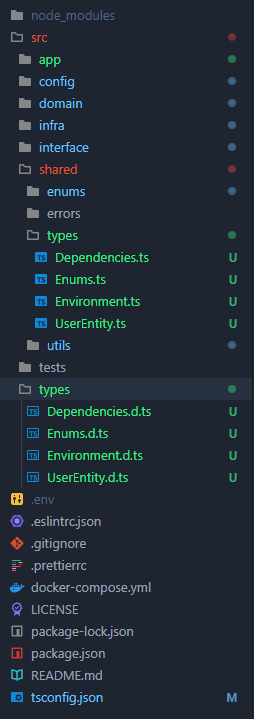

# Guias de desenvolvimento

## Erro de tipagens
Caso você tenha problemas com tipagem na hora de exportar elas do arquivo "types" encontrado na raíz do projeto, você deverá copiar a pasta "types" e colar ela dentro de shared e mudar todos os formatos dos arquivos para ".ts" ao invés de ".d.ts"

Vale mencionar que você precisará fazer algumas mudanças de import mas não é nada extremamente significativo

**Exemplo:** 

